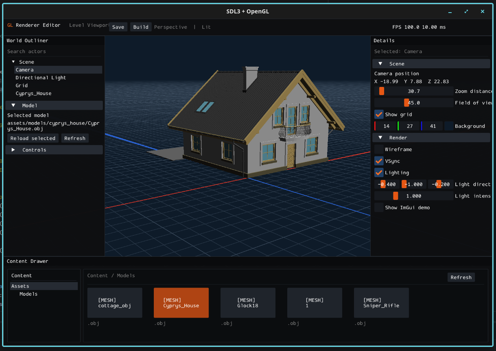

# OpenGL Renderer



This is a small renderer I built while learning more about OpenGL and the graphics pipeline.

The main goal was to get hands-on experience with the parts that are usually hidden behind an engine: creating GPU buffers, sending vertex data, writing shaders, loading meshes and materials, handling depth and transparency, and putting the final image on screen.

It is still a work in progress. There are bugs, incomplete features, and models that may not render perfectly. The project is mostly a place for me to test ideas and understand how each stage of a real-time renderer fits together.

## What is implemented

- OpenGL 4.6 renderer using SDL3
- Orbit camera with pan and zoom
- OBJ, glTF and GLB loading
- Cook-Torrance PBR shading with GGX
- Base color, metallic/roughness, normal, AO and emissive textures
- Alpha masking and blending
- Normal and tangent generation when mesh data is missing
- Procedural editor grid
- HiDPI support
- ImGui interface inspired by Blender and Unreal Editor

## Known limitations

- There is no image-based lighting or environment map yet
- Transparent primitives are not sorted by distance
- OBJ material support is basic
- Some UI options are currently visual only
- Model framing and scale still need improvement
- The renderer has not been tested on many GPUs or platforms

## Building

The dependencies are included in the repository. You need CMake, Ninja, a C++17 compiler, and an OpenGL 4.6 capable driver.

```bash
cmake -S . -B build -G Ninja
cmake --build build
```

Run it from the project root:

```bash
./build/glrenderer
```

## Controls

- Left mouse drag: orbit
- Right mouse drag: pan
- Mouse wheel: zoom
- `W`, `A`, `S`, `D`: move the camera target

## Main libraries

- SDL3
- GLAD
- GLM
- Dear ImGui
- tinyobjloader
- fastgltf
- simdjson
- stb_image
